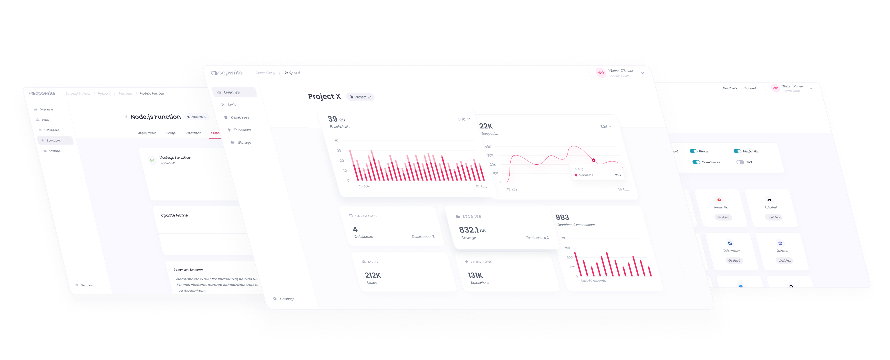

# 🖥️ Appwrite Console

[](https://appwrite.io/discord)
[](https://twitter.com/appwrite)
[](https://appwrite.io)

[Appwrite](https://appwrite.io) Console is the Graphical User Interface that developers interact with when accessing their Appwrite instance in the web browser.

### Built With

Appwrite Console uses the following libraries/frameworks:

-   [Svelte](https://svelte.dev/)
-   [Svelte Kit](https://kit.svelte.dev/)
-   [@appwrite/ui](https://github.com/appwrite/ui)

## Table of Contents:

-   [Development](#development)
    -   [Build](#build)
    -   [Tests](#tests)
    -   [Format](#format)
    -   [Linter](#linter)
    -   [Diagnostics](#diagnostics)
-   [Contributing](#contributing)
-   [Security](#guidelines)
-   [Follow Us](#follow-us)
-   [Licence](#license)

## Development

Once you've created a project and installed dependencies with `npm install`, start a development server:

```bash
npm run dev
```

### Build

```bash
npm run build
```

> You can preview the built app with `npm run preview`, regardless of whether you installed an adapter. This should _not_ be used to serve your app in production.

### Tests

```bash
npm test
```

This will run tests in the `tests/` directory.

### Format

Code should like everywhere the same, for this reason a code-formatter is mandatory.

```bash
npm run format
```

### Linter

```bash
npm run lint
```

### Diagnostics

Diagnostic tool that checks for following:

-   Unused CSS
-   Svelte A11y hints
-   TypeScript compiler errors

```bash
npm run check
```

## Contributing

All code contributions - including those of people having commit access - must go through a pull request and be approved by a core developer before being merged. This is to ensure a proper review of all the code.

We truly ❤️ pull requests! If you wish to help, you can learn more about how you can contribute to this project in the [contribution guide](CONTRIBUTING.md).

## Security

For security issues, kindly email us at [security@appwrite.io](mailto:security@appwrite.io) instead of posting a public issue on GitHub.

## Follow Us

Join our growing community around the world! See our official [Blog](https://medium.com/appwrite-io). Follow us on [Twitter](https://twitter.com/appwrite), [Facebook Page](https://www.facebook.com/appwrite.io), [Facebook Group](https://www.facebook.com/groups/appwrite.developers/), [Dev Community](https://dev.to/appwrite) or join our live [Discord server](https://appwrite.io/discord) for more help, ideas, and discussions.

## License

This repository is available under the [BSD 3-Clause License](./LICENSE).
